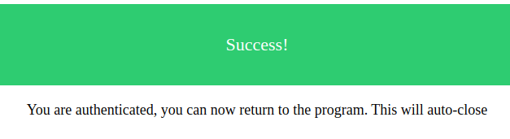

[](https://cloud.drone.io/gphotosuploader/gphotos-uploader-cli)
[](https://goreportcard.com/report/github.com/gphotosuploader/gphotos-uploader-cli)
[](https://codebeat.co/projects/github-com-gphotosuploader-gphotos-uploader-cli-master)
[](https://codecov.io/gh/gphotosuploader/gphotos-uploader-cli)
[](https://github.com/gphotosuploader/gphotos-uploader-cli/releases/latest)
[](LICENSE)
<!--- [](https://build.snapcraft.io/user/gphotosuploader/gphotos-uploader-cli) --->

# Google Photos uploader CLI

Command line tool to mass upload media folders to your Google Photos account(s).    

While the official tool only supports Mac OS and Windows, this brings an uploader to Linux too. Lets you upload photos from, in theory, any OS for which you can compile a Go program.     

# Features

- **Customizable configuration**: via JSON-like config file.
- **Multiple Google accounts support**: upload your pictures to multiple accounts.
- **Filter files with patterns**: include/exclude files & folders using patterns (see [documentation](.docs/configuration.md)).
- **Resumable uploads**: Uploads can be resumed, saving time and bandwidth. 
- **File deletion after uploading**: Clean up local files after being uploaded.
- **Track already uploaded files**: uploads only new files to save bandwidth.
- **Secure**: logs you into Google using OAuth (so this app doesn't have to know your password), and stores your temporary access code in your OS's secure storage (keyring/keychain).

# Getting started

## Install
You can install the pre-compiled binary (in several different ways) or compile from source.

Here are the steps for each of them:

### Install the pre-compiled binary

**homebrew tap** (only on macOS for now):
```
$ brew install gphotosuploader/tap/gphotos-uploader-cli
```

**manually**

Download the pre-compiled binaries from the [releases page](https://github.com/gphotosuploader/gphotos-uploader-cli/releases/latest) and copy to the desired location.

### Compiling from source

> This project will maintain compatibility with the last two Go major versions published. Currently Go 1.12 and Go 1.13. 

You can compile the source code in your system. **Go 1.12+** is required to compile this application:

```
$ git clone https://github.com/gphotosuploader/gphotos-uploader-cli
$ cd gphotos-uploader-cli
$ make build
```

Or you can use `go get` if you prefer it:

```
$ go get github.com/gphotosuploader/gphotos-uploader-cli
```

## Configure
First initialize the config file using this command:
```
$ gphotos-uploader-cli init
```

> Default configuration folder is `~/.config/gphotos-uploader-cli` but you can specify your own folder using `--config /my/config/dir`. Configuration is kept in the `config.hjson` file inside this folder.

You must review the [documentation](.docs/configuration.md) to specify your **Google Photos API credentials**, `APIAppCredentials`. You should tune your `jobs` configuration also.

## Run
Once it's configured you can start uploading files in this way:
``` 
$ gphotos-uploader-cli
```

### First time run
The first time you run `gphotos-uploader-cli`, after setting your configuration ([Google Photos API credentials](.docs/configuration.md#APIAppCredentials)), few manual steps are needed:

1. You should get an output like this one:

```
2019/09/07 17:47:11 Token has not been retrieved from token store: failed retrieving token from keyring
2019/09/07 17:47:11 Open http://localhost:40923
```

1. A browser will be opened at this point. Select the account where you wan to upload your files (the same you configured in the config file). You will see something like this:

 

1. After that, you should confirm that you trust on `gphotos-uploader-cli` to access to your Google Photos account, click on **Go to gphotos-uploader**:


1. Finally Google will ask you to confirm permission Google Photos account:


1. A green page is shown if all is fine



1. Go back to your terminal, you will see something like:

```
2019/09/07 17:47:23 Token expiration: 2019-09-07 18:47:23.588661948 +0200 CEST m=+3612.289671492
```

All auth configuration is in place.

# Contributing
Help us make `gphotos-uploader-cli` the best tool for uploading your local pictures to Google Photos.

## Reporting Issues
If you find a bug while working with `gphotos-uploader-cli`, please [open an issue on GitHub](https://github.com/gphotosuploader/gphotos-uploader-cli/issues/new?assignees=pacoorozco&labels=bug&template=bug_report.md) and let us know what went wrong. We will try to fix it as quickly as we can.

## Feedback & Feature Requests
You are more than welcome to open issues in this project to:

- [give feedback](https://github.com/gphotosuploader/gphotos-uploader-cli/issues/new?title=Feedback:)
- [suggest new features](https://github.com/gphotosuploader/gphotos-uploader-cli/issues/new?labels=feature+request&template=feature_request.md)

## Contributing Code
This project is mainly written in Golang. If you want to contribute code, see [Contributing guide lines](CONTRIBUTING.md) for more information.

# License
 
 Use of this source code is governed by an MIT-style license that can be found in the LICENSE [MIT](LICENSE) file.
