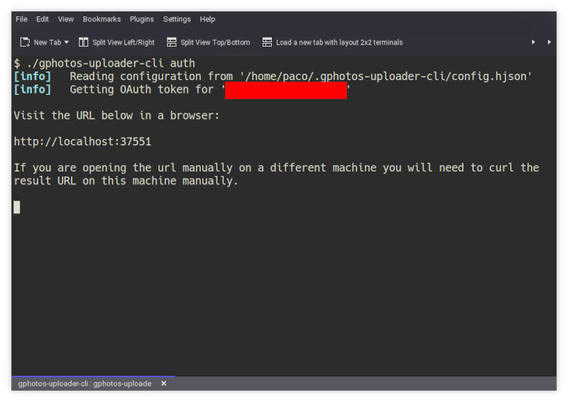
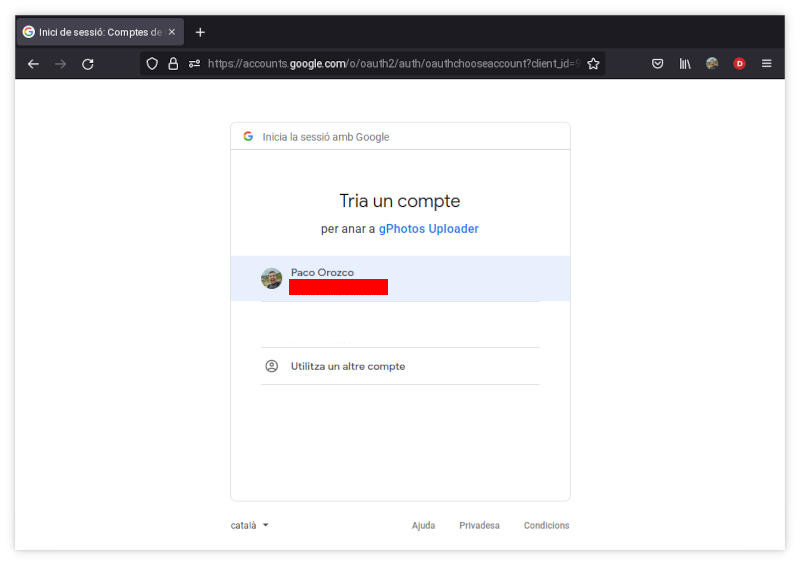
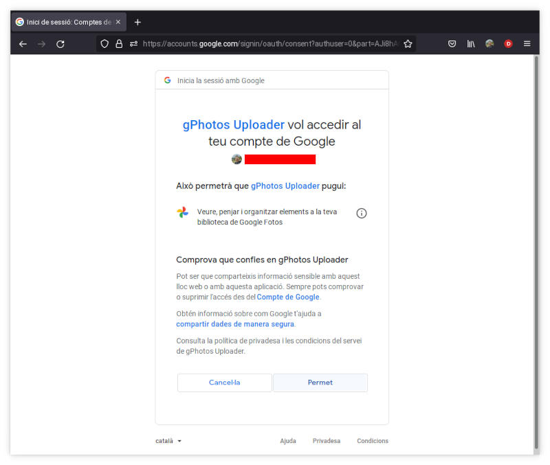
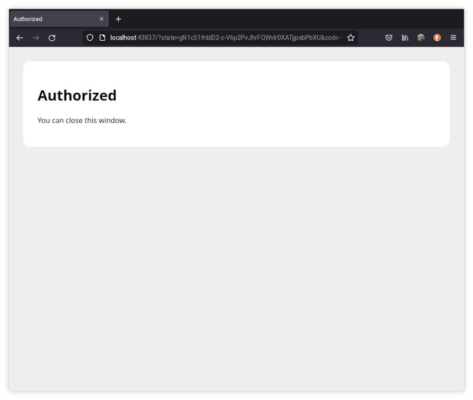
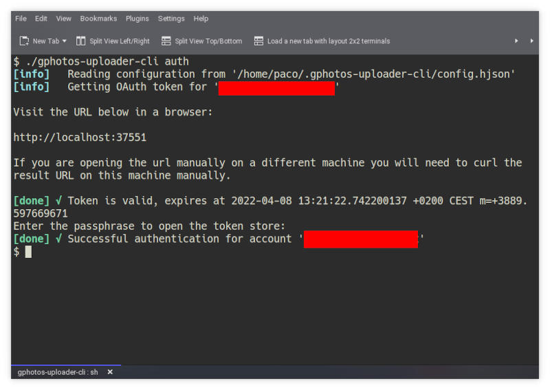

# Getting started

## Install
You can install the pre-compiled binary (in several different ways) or compile from source.

Here are the steps for each of them:

### Install the pre-compiled binary

#### homebrew tap (only on macOS for now):
```bash
$ brew install gphotosuploader/tap/gphotos-uploader-cli
```

#### manually

Download the pre-compiled binaries from the [releases page](https://github.com/gphotosuploader/gphotos-uploader-cli/releases/latest) and copy to the desired location.

For Linux:
```bash
$ LOCATION=$(curl -s https://api.github.com/repos/gphotosuploader/gphotos-uploader-cli/releases/latest \
| grep browser_download_url \
| awk '{ print $2 }' \
| tr -d \" \
| grep linux); wget --quiet -O - $LOCATION | tar -zxf -
```

For macOS:
```bash
$ LOCATION=$(curl -s https://api.github.com/repos/gphotosuploader/gphotos-uploader-cli/releases/latest \
| grep browser_download_url \
| awk '{ print $2 }' \
| tr -d \" \
| grep darwin); wget --quiet -O - $LOCATION | tar -zxf -
```

### Compiling from source

> This project will maintain compatibility with the last two Go major versions published. It could work with other versions but we can't support it. 

You can compile the source code in your system.

```bash
$ git clone https://github.com/gphotosuploader/gphotos-uploader-cli
$ cd gphotos-uploader-cli
$ make build
```

Or you can use `go get` if you prefer it:

```bash
$ go get github.com/gphotosuploader/gphotos-uploader-cli
```

## Configure
First initialize the config file using this command:
```bash
$ gphotos-uploader-cli init
```

> Default configuration folder is `~/.gphotos-uploader-cli` but you can specify your own folder using `--config /my/config/dir`. Configuration is kept in the `config.hjson` file inside this folder.

You must review the [documentation](configuration.md) to specify your **Google Photos API credentials**, `APIAppCredentials`. You should tune your `jobs` configuration also.

## Authentication
Once it's configured you new to authenticate your CLI against Google Photos:
```bash 
$ gphotos-uploader-cli auth
```

Few manual steps are needed:

1. You should get an output like this one:



2. Open a browser and point to the previous URL. Select the account to authenticate the CLI with (the same you configured in the config file). You will see something like this:

 

3. After that, you should confirm that you trust on `gphotos-uploader-cli` to access to your Google Photos account, click on **Allow**:



4. A page with a code is shown in your browser, copy this code and go back to the terminal.



5. Go back to your terminal window. The authentication process is complete.

